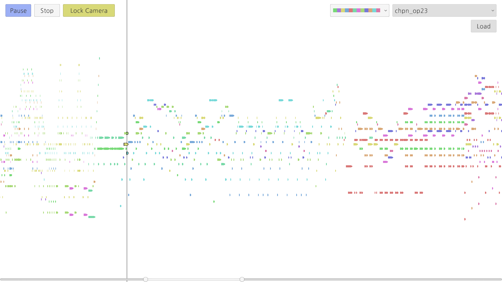

# Chromatic Piano Roll

음악을 피아노 롤 표현법으로 시각화하고 여기에 적절한 색을 입혀 음악 분석을 돕는 도구입니다.  
Chromatic Piano Roll is a tool that visualizes music using the piano roll representation and applies appropriate colors to assist in music analysis.

### How To Use
> Currently, it is supported only on Windows.

1. Start the server.
```console
> python -m venv Server
> cd Server
> ./Scripts/activate
(Server) > pip install -r requirements.txt
(Server) > uvicorn main:app --reload
```
2. Download `Chromatic Piano Roll v0.2.zip` [(click here!)](https://github.com/salt26/chromatic-piano-roll/releases/tag/v0.2), unzip it, and execute `Chromatic Piano Roll.exe`.
3. Select the music from the dropdown menu in the top right corner, or load your custom MIDI file from your computer.
4. Play the music from the button in the top left corner.
5. You can adjust the range of the slider at the bottom to zoom in on the visualization.

